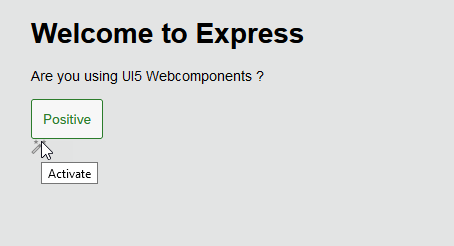

# UI5 WebComponent in plain Express Server
## What is it ?
Simple example of how to use UI5 Webcomponents without further frameworks like *VUE* , *REACT* or *ANGULAR*
## When do you need it
* Your are just rapid prototyping an app with a **business ready** layout.
* Or you want to check if UI5 Webcomponents fit your requirements.
## What are the importent node.js modules
* Express.js 
* @UI5/Webcomponents 
* Rollup.js with Plugins RESOLVE and JSON

## How to use it
* clone from git
* run  'npm install'
* run  'npm run build'
* run  'npm run start'
 
## What are the main files/folders
* /src/bundle.esm.js (modules you need for your project )
* rollup.config.js (config for rollup build tool)
* /public/bundle -> there goes your bundles

